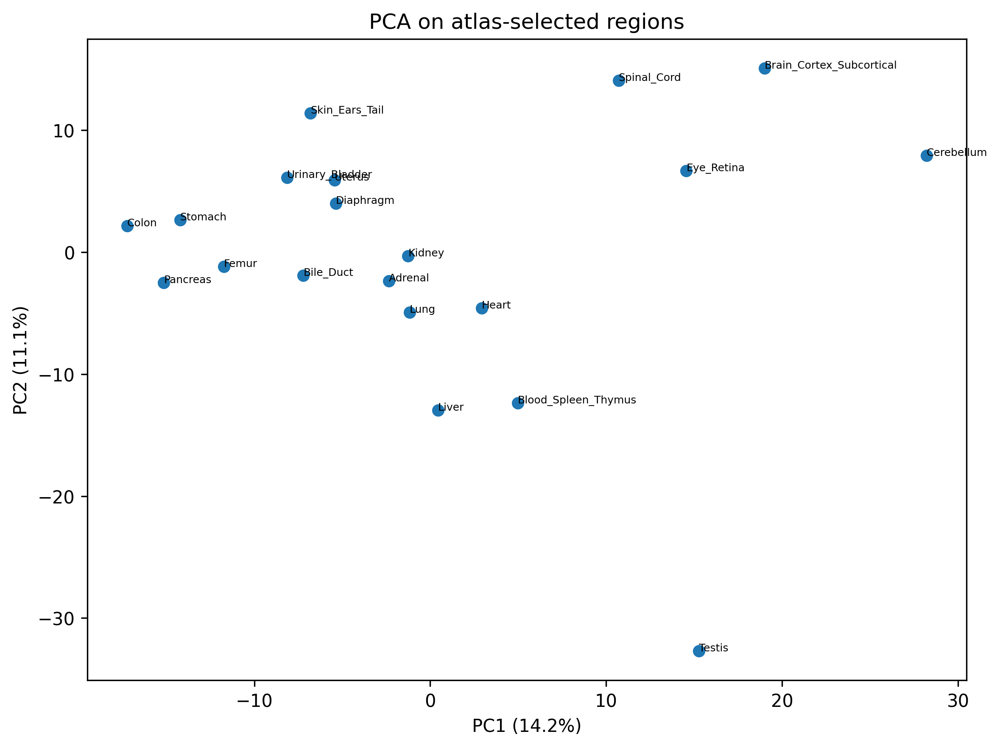
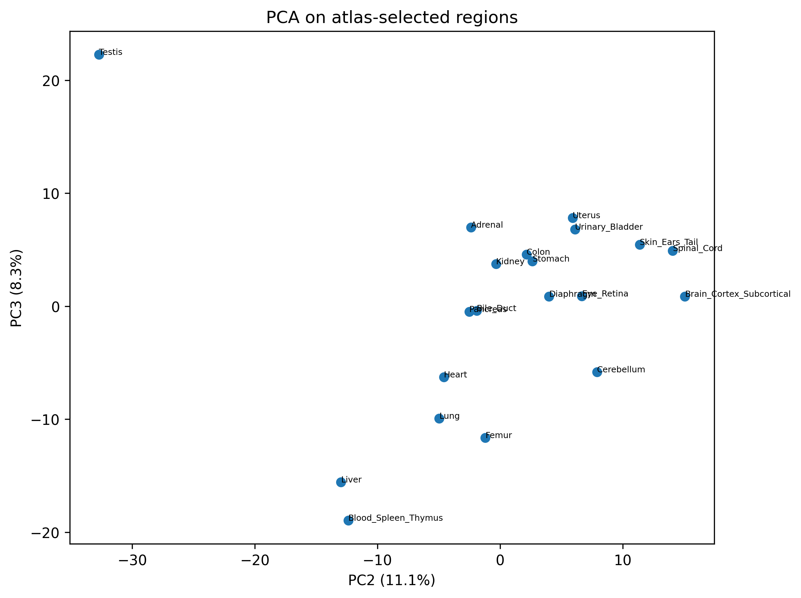
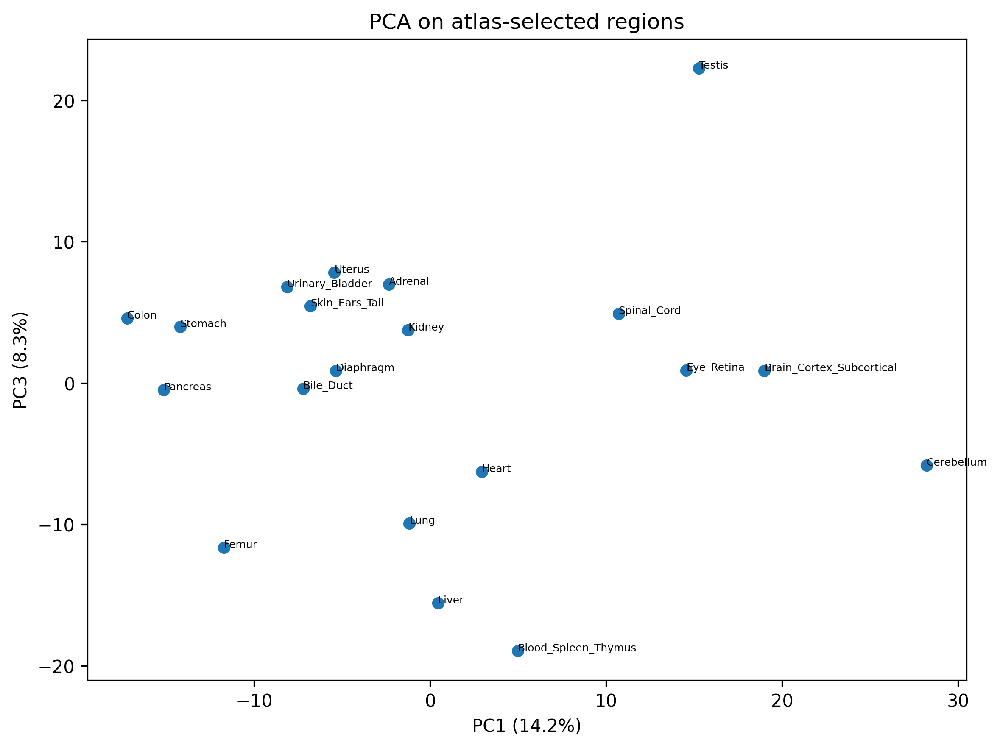
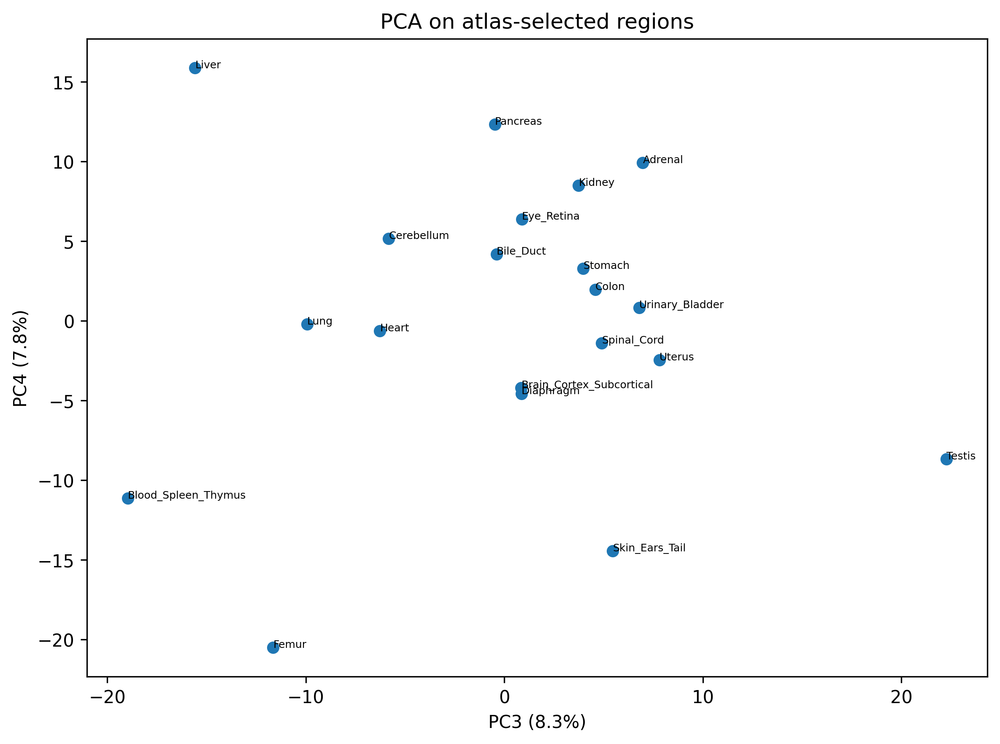
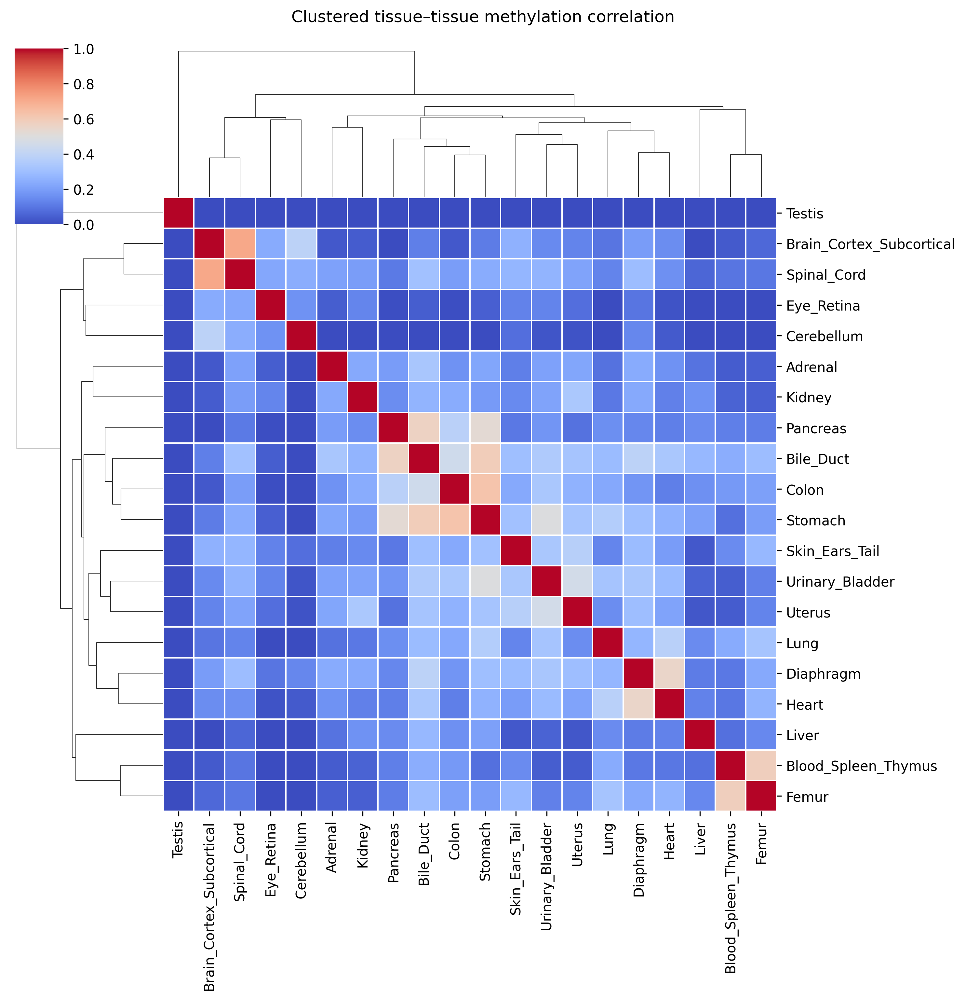
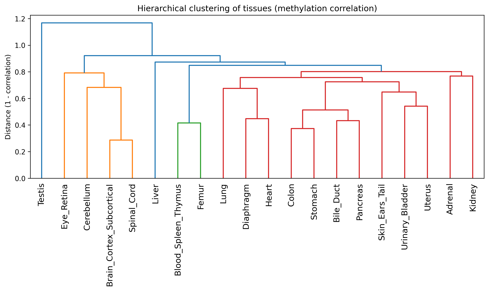
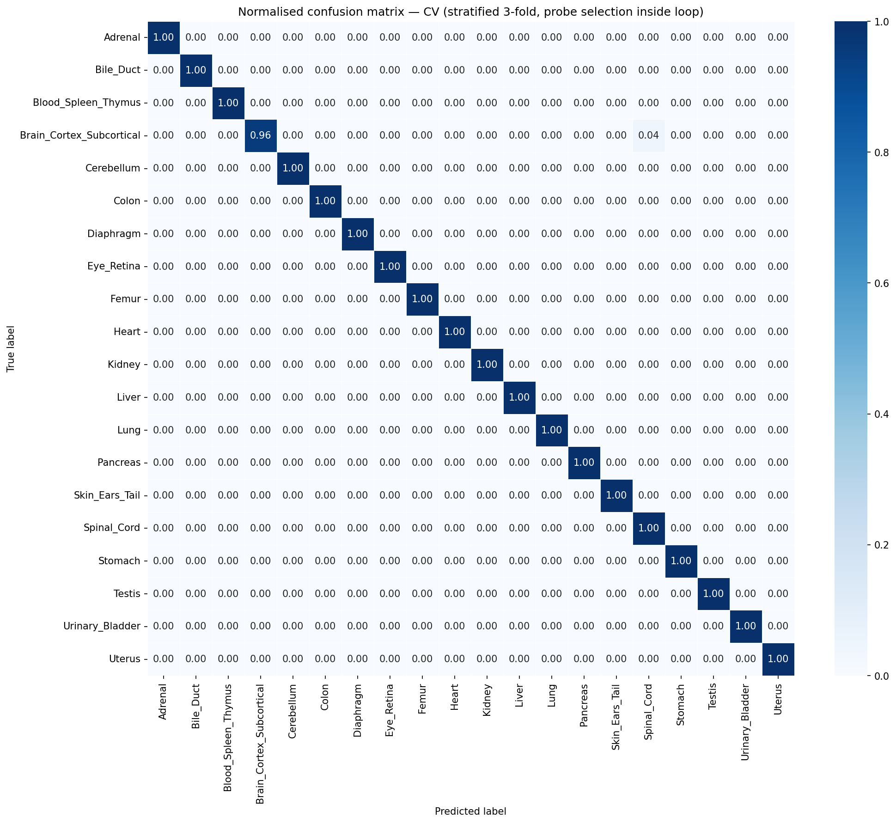
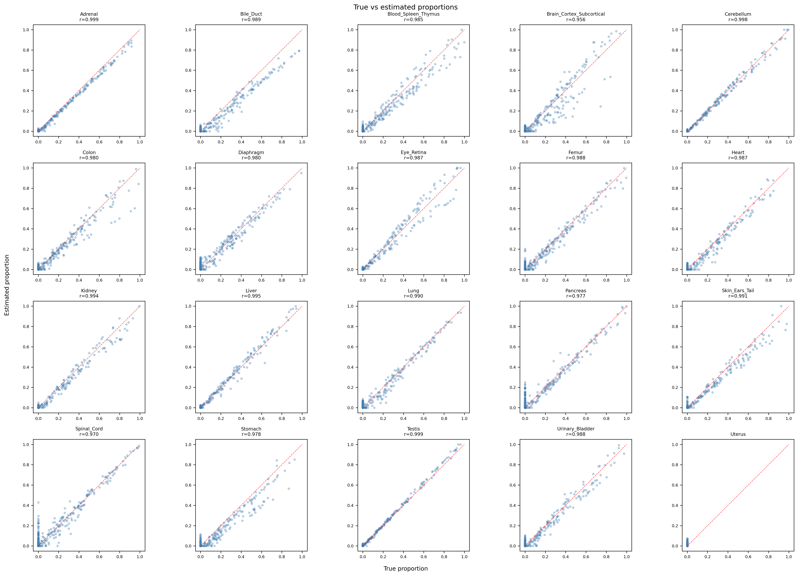
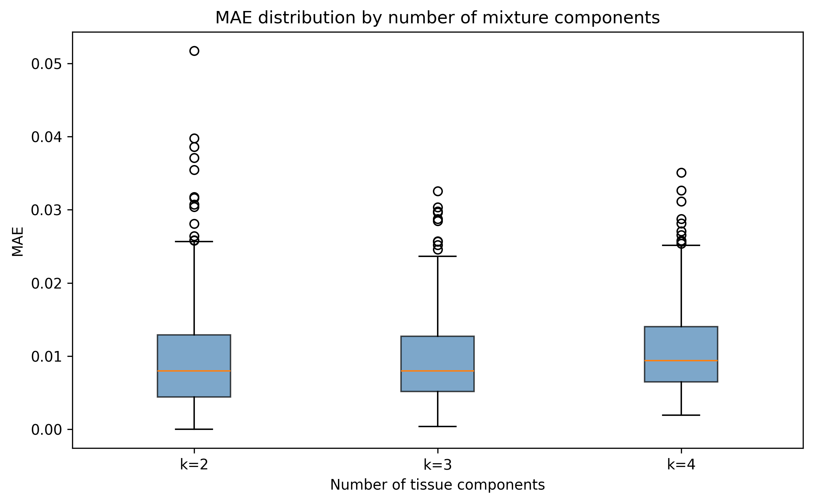
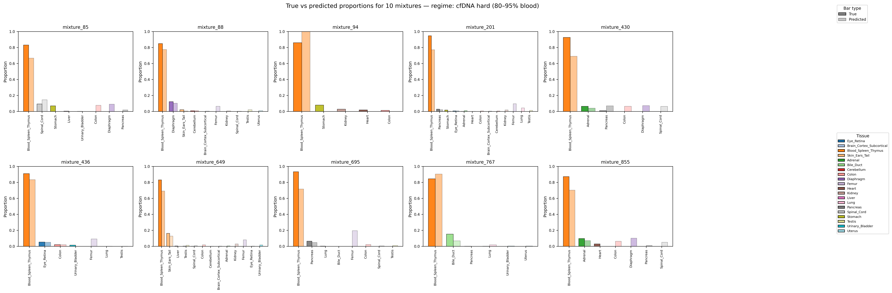

# Mouse DNA Methylation — Modeling Figures

## 1. Tissue-specific methylation atlas

Tissue-specific unmethylated markers selected from ~288,655 CpG probes across 268 replicates. For every probe and tissue, a differential score is computed as *background − target* methylation, where target is the mean β-value in the tissue of interest and background is the mean β-value across all other tissues. Probes are filtered to those methylated in the background, ranked by differential score, and reduced to markers unique to a single tissue (capped at 50 per tissue), yielding ~950 markers across 20 tissue classes. Rows are tissues, columns are markers; blue indicates unmethylated (≈0) in the target tissue and yellow indicates methylated (≈1) elsewhere. The block-diagonal structure shows each tissue carries a private methylation signature.

## 2. PCA on atlas-selected regions

Projection of the 20 tissues onto the selected atlas markers, shown across the first four principal components (PC1 = 14.2%, PC2 = 11.1%, PC3 = 8.3%, PC4 = 7.8%; PC1–PC10 cumulative = 75.8%). All tissue classes separate in the low-dimensional space, with variance distributed across many components rather than dominated by a single axis. Neuronal tissues (cerebellum, brain cortex, spinal cord, eye/retina) and testis lie at the extremes across multiple component pairs, confirming the selected features encode genuine tissue identity.

## 3. Clustered tissue–tissue correlation

Pairwise correlation of tissue methylation profiles over the atlas markers, with hierarchical clustering (average linkage) on rows and columns. The recovered groups are biologically coherent — blood/spleen/thymus, brain cortex with spinal cord, and the gastrointestinal tissues (colon, stomach, bile duct) — and informed the merging of 29 original tissue types into 20 classes.

## 4. Hierarchical clustering of tissues

Dendrogram of the same tissue correlation structure, using distance = 1 − correlation. Testis is the most distinct tissue; the neuronal cluster (eye/retina, cerebellum, brain cortex, spinal cord) and the blood/spleen/thymus + femur group separate early, consistent with known tissue biology.

## 5. Tissue classifier — cross-validated confusion matrix

Multinomial logistic regression classifying individual replicates into 20 tissue classes, evaluated with stratified 3-fold cross-validation. Marker selection is performed inside each fold to prevent leakage. Row-normalised confusion is near-diagonal, with the only notable error being 4% of brain-cortex replicates assigned to spinal cord. Accuracy is likely optimistic given the small number of replicates per tissue.

## 6. Deconvolution — true vs estimated proportions

Non-negative least squares (NNLS) deconvolution of synthetic mixtures against the atlas signature matrix, using a strict reference/mixture split. Each panel shows true vs estimated proportion for one tissue across all mixtures, with per-tissue Pearson r of 0.96–0.999 (median MAE ≈ 0.008). Uterus has too few pool replicates to evaluate.

## 7. Deconvolution — accuracy vs mixture complexity

Mean absolute error of estimated proportions stratified by the number of tissues contributing to each synthetic mixture. Error remains low and stable (median MAE ≈ 0.01) as mixtures become more complex from 2 to 4 components.

## 8. cfDNA-style blood-dominant deconvolution

Deconvolution of blood-dominant mixtures (80–95% `Blood_Spleen_Thymus`) that approximate cfDNA from a blood draw. For each mixture, true and predicted proportions are shown side by side; the dominant blood component and minor tissue contributions are both recovered. `Blood_Spleen_Thymus` is a bulk proxy for true cfDNA composition, so these are feasibility estimates rather than quantitative cfDNA predictions.
