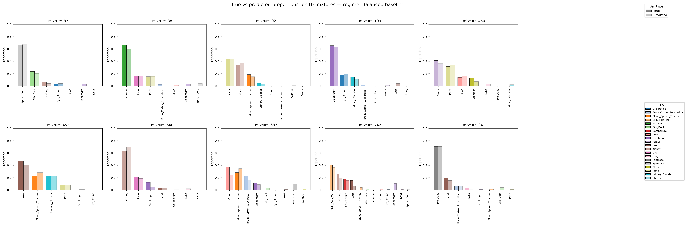
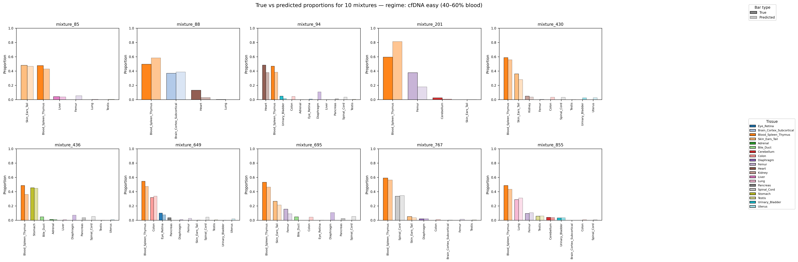
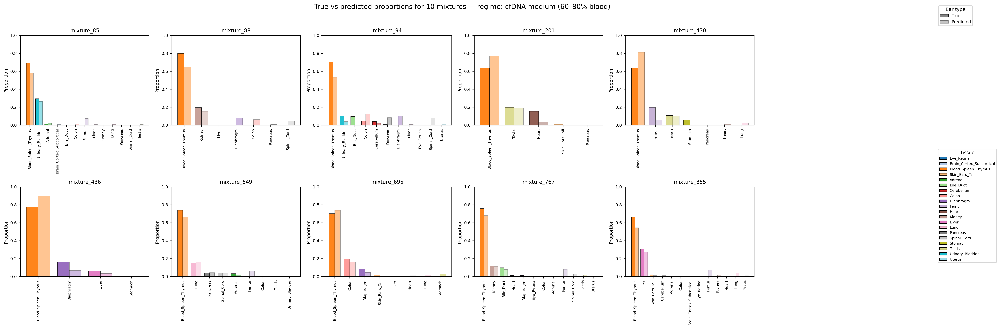

# Mouse DNA Methylation — Modeling Figures

## 1. Tissue-specific methylation atlas

Tissue-specific unmethylated markers selected from ~288,655 CpG probes (Illumina MM285 array) across 268 mouse replicates. For every probe and tissue, a differential score is computed as *background − target* methylation, where target is the mean β-value in the tissue of interest and background is the mean β-value across all other tissues. Probes are filtered to those methylated in the background, ranked by differential score, and reduced to markers unique to a single tissue (capped at 50 per tissue), yielding ~950 markers across 20 tissue classes. Rows are tissues, columns are markers; blue indicates unmethylated (≈0) in the target tissue and yellow indicates methylated (≈1) elsewhere. The block-diagonal structure shows each tissue carries a private methylation signature.

## 2. PCA of atlas markers — PC1 vs PC2

Principal component analysis of the 20 mouse tissue classes projected onto the ~950 tissue-specific methylation markers of the atlas, shown for the first two components (PC1 = 14.2%, PC2 = 11.1% of variance; each point is one tissue). The tissues separate cleanly, with neuronal tissues (cerebellum, brain cortex, spinal cord, eye/retina) and testis at the extremes. Variance is spread across many components rather than dominated by a single axis (PC1–PC10 cumulative = 75.8%), indicating the selected markers encode genuine, distributed tissue identity rather than technical variation.

## 3. PCA of atlas markers — PC2 vs PC3

Principal component analysis of the 20 mouse tissue classes projected onto the ~950 tissue-specific methylation markers of the atlas, shown for the second and third components (PC2 = 11.1%, PC3 = 8.3% of variance; each point is one tissue). Testis separates strongly along PC3 while blood/spleen/thymus and liver anchor the opposite end, and the remaining tissues spread out without overlap. The clear separation on these lower-ranked components shows that tissue-discriminating signal is distributed across many axes (PC1–PC10 cumulative = 75.8%), confirming the markers capture genuine tissue identity.

## 4. PCA of atlas markers — PC1 vs PC3

Principal component analysis of the 20 mouse tissue classes projected onto the ~950 tissue-specific methylation markers of the atlas, shown for the first and third components (PC1 = 14.2%, PC3 = 8.3% of variance; each point is one tissue). Cerebellum, brain cortex, eye/retina and spinal cord occupy high PC1, while testis is isolated on PC3; all tissues remain individually resolved. The clean separation across these components, with variance spread over many axes (PC1–PC10 cumulative = 75.8%), confirms the selected markers encode genuine tissue identity.

## 5. PCA of atlas markers — PC3 vs PC4

Principal component analysis of the 20 mouse tissue classes projected onto the ~950 tissue-specific methylation markers of the atlas, shown for the third and fourth components (PC3 = 8.3%, PC4 = 7.8% of variance; each point is one tissue). Even on these minor axes the tissues remain well separated — liver, femur, blood/spleen/thymus and skin/ears/tail each occupy distinct positions — demonstrating that tissue-discriminating signal persists well beyond the leading components (PC1–PC10 cumulative = 75.8%) and is not confined to a single dominant axis.

## 6. Clustered tissue–tissue correlation

Pairwise Pearson correlation of the 20 mouse tissue methylation profiles computed over the atlas markers, with hierarchical clustering (average linkage) applied to rows and columns. The recovered groups are biologically coherent — blood/spleen/thymus, brain cortex with spinal cord, and the gastrointestinal tissues (colon, stomach, bile duct) — and this structure informed the merging of the 29 original tissue types into 20 classes used throughout the analysis.

## 7. Hierarchical clustering of tissues

Dendrogram of the 20 mouse tissue classes built from their methylation-profile correlations over the atlas markers, using distance = 1 − correlation (average linkage). Testis is the most distinct tissue; the neuronal cluster (eye/retina, cerebellum, brain cortex, spinal cord) and the blood/spleen/thymus + femur group separate early. The recovered hierarchy is consistent with known tissue biology, providing an independent check that the atlas markers reflect real biological relationships.

## 8. Deconvolution — true vs estimated proportions

Non-negative least squares (NNLS) deconvolution of synthetic tissue mixtures against the atlas signature matrix, using a strict split between reference replicates (which build the signature) and pool replicates (which build the mixtures). Each panel shows true vs estimated proportion for one tissue across all synthetic mixtures with known ground truth, with per-tissue Pearson r of 0.96–0.999 (median MAE ≈ 0.008). Uterus has too few pool replicates to evaluate. The tight agreement demonstrates accurate quantitative recovery of tissue composition.

## 9. Deconvolution — accuracy vs mixture complexity

Mean absolute error (MAE) of NNLS-estimated tissue proportions, stratified by the number of tissues contributing to each synthetic mixture, evaluated against known ground-truth proportions. Error remains low and stable (median MAE ≈ 0.01) as mixtures become more complex from 2 to 4 components, showing the atlas-based deconvolution degrades gracefully with increasing mixture complexity.

## 10. Deconvolution barplots — balanced baseline

NNLS deconvolution of synthetic mouse tissue mixtures against the atlas signature matrix, shown as ten representative example mixtures. Each panel is one mixture; bars are grouped per tissue as true (darker) vs predicted (lighter) proportion and coloured by tissue. In this balanced baseline regime, mixtures are drawn from 2–4 randomly chosen tissues with uniform (Dirichlet) proportions and no forced dominant tissue. Predicted proportions closely track the ground truth across dominant and minor components, illustrating faithful per-mixture composition recovery.

## 11. Deconvolution barplots — cfDNA easy (40–60% blood)

NNLS deconvolution of synthetic blood-dominant mixtures that approximate cfDNA from a blood draw, shown as ten representative example mixtures. Each panel is one mixture; bars are grouped per tissue as true (darker) vs predicted (lighter) proportion and coloured by tissue. In this "easy" regime `Blood_Spleen_Thymus` contributes 40–60% of each mixture, with the remainder split among other tissues. The dominant blood component and the minor tissue contributions are both recovered. `Blood_Spleen_Thymus` is a bulk proxy for true cfDNA composition, so results are feasibility estimates rather than quantitative cfDNA predictions.

## 12. Deconvolution barplots — cfDNA medium (60–80% blood)

NNLS deconvolution of synthetic blood-dominant mixtures that approximate cfDNA from a blood draw, shown as ten representative example mixtures. Each panel is one mixture; bars are grouped per tissue as true (darker) vs predicted (lighter) proportion and coloured by tissue. In this "medium" regime `Blood_Spleen_Thymus` contributes 60–80% of each mixture, with the remainder split among other tissues. Despite the stronger blood dominance, minor tissue fractions are still detected alongside the dominant component. `Blood_Spleen_Thymus` is a bulk proxy for true cfDNA composition, so results are feasibility estimates rather than quantitative cfDNA predictions.

## 13. Deconvolution barplots — cfDNA hard (80–95% blood)

NNLS deconvolution of synthetic blood-dominant mixtures that approximate cfDNA from a blood draw, shown as ten representative example mixtures. Each panel is one mixture; bars are grouped per tissue as true (darker) vs predicted (lighter) proportion and coloured by tissue. In this "hard" regime `Blood_Spleen_Thymus` contributes 80–95% of each mixture — the most challenging cfDNA-like setting — yet the dominant blood component and small non-blood contributions are still recovered. `Blood_Spleen_Thymus` is a bulk proxy for true cfDNA composition, so results are feasibility estimates rather than quantitative cfDNA predictions.
