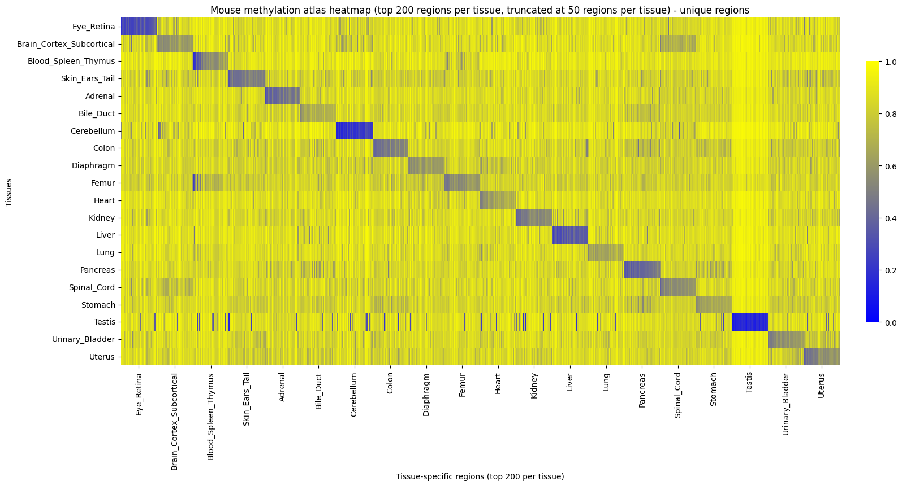

# Mouse DNA Methylation Atlas for cfDNA Deconvolution

## Overview

This repository contains a research project at Lund University focused on mouse cancer models. The aim is to construct a mouse DNA methylation atlas analogous to the Human Methylation ATLAS by Loyfer et al.

Using region level DNA methylation data across a wide range of mouse tissues, the project identifies tissue specific unmethylated genomic regions by comparing target tissue methylation against background methylation across all other tissues. These regions form the basis of a reference atlas capturing tissue specific methylation patterns.

## Heatmap of Top Regions

## Atlas Construction

The initial stage of the project focuses on atlas construction. DNA methylation data are organized at the genomic region level and aggregated across biological replicates to obtain one methylation profile per tissue. For each tissue, uniquely unmethylated regions are identified by ranking regions based on the difference between background methylation across all other tissues and methylation in the target tissue.

The resulting set of tissue specific regions is visualized as an atlas style heatmap, analogous to Figure 3 in the Human Methylation ATLAS, where rows represent tissues and columns represent tissue specific genomic regions.

## Downstream Applications

In later stages, the atlas will be used as a reference for modeling and deconvolution of mouse cell free DNA. The goal is to estimate tissue of origin and tissue proportions from cfDNA samples in cancer related settings, enabling controlled validation of methylation based deconvolution methods in mouse models.

## Project Status

Atlas construction and region selection are currently in progress. Downstream modeling and cfDNA deconvolution methods will be added in subsequent stages.

## References

Loyfer et al., A DNA methylation atlas of normal human cell types, Nature, 2023.

# Data location
Sequencing data is stored outsite the git repository at:

~/data/raw
