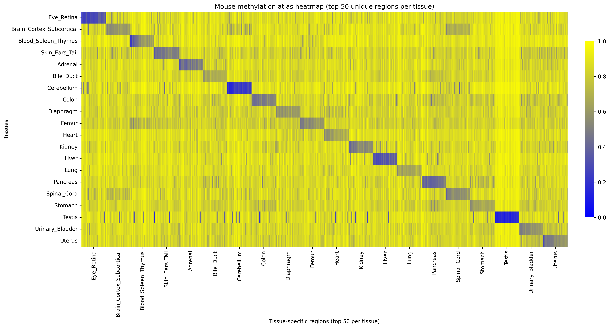

# Mouse DNA Methylation Atlas & Tissue Classification/Deconvolution

A modular Python pipeline for building a tissue-specific DNA methylation atlas from mouse MM285 array data, training a leakage-free tissue classifier, and performing reference-based tissue deconvolution from methylation profiles.

---

## Project Overview

This project processes Illumina MM285 methylation array data (beta values) from 268 biological replicates across 29 mouse tissue types. The pipeline identifies tissue-specific differentially methylated CpG regions, builds a methylation atlas, and uses the selected markers for downstream tissue classification and deconvolution.

The work is inspired by the Human Methylation Atlas (Loyfer et al., Nature 2023), with the goal of enabling **controlled validation of methylation-based tissue-of-origin methods in mouse models**, particularly in cfDNA settings.

---

## Atlas Overview

The atlas is constructed by identifying **tissue-specific unmethylated regions** through comparison of each tissue against all others. Regions are ranked based on the difference between background methylation and target tissue methylation, and the top markers define a reference signature for each tissue.

### Heatmap of Top Regions



Rows represent tissues and columns represent selected tissue-specific genomic regions, analogous to the Human Methylation Atlas.

---

## Three Independent Pipelines

### **Pipeline 1 — Methylation Atlas** (`run_pipeline.py`)
Builds the full tissue methylation atlas from all 268 samples.

- Computes differential methylation scores  
- Selects tissue-specific marker probes  
- Generates heatmaps, correlation matrices, dendrograms  
- Exports annotated marker regions to Excel  

This pipeline uses all available data and produces the **reference atlas** used for downstream analysis.

---

### **Pipeline 2 — Tissue Classifier** (`run_classifier.py`)
Trains a multinomial logistic regression classifier on individual replicates using merged tissue labels (20 classes).

- Leakage-free design: probe selection performed inside each CV fold  
- Uses only fold-training data for feature selection and model fitting  
- Evaluated on a held-out test set (1 sample per original tissue type)  

**Note:**  
Classifier performance is near-perfect (~100% accuracy), but evaluation is limited to a very small test set (one replicate per tissue). This likely overestimates real-world performance and should be interpreted with caution.

---

### **Pipeline 3 — Tissue Deconvolution** (`run_deconvolution.py`)
Estimates tissue proportions from mixed methylation signals using non-negative least squares (NNLS).

- Splits replicates into:
  - **Reference set** (builds signature matrix and selects probes)  
  - **Mixture pool** (generates synthetic mixtures)  
- Evaluates performance on synthetic mixtures with known ground truth  

**Current status:**  
Deconvolution is implemented and under active evaluation. Ongoing work focuses on:
- Verifying correctness and baseline performance  
- Increasing mixture complexity  
- Testing robustness under more realistic conditions  

---

## Data

**Input files** (not included in the repository):

| File | Description | Location |
|------|-------------|----------|
| `GSE290585_SeSaMeBeta_MM285_BS_simplified_columns.csv` | Processed beta-value matrix (probes × samples) | `~/projects/data/processed/` |
| `12_02_2026_MM285.csv` | MM285 probe annotation file (genomic coordinates, gene names) | `~/projects/data/original/` |

**Raw sequencing data (external to repo):**
~/data/raw

**Data dimensions:**
- ~288,655 probes × 268 sample replicates  
- 29 original tissue types → 20 merged classes  

---

## Tissue Merging and Exclusion

Based on correlation analysis of the atlas:

**Merged groups:**
- Eye + Retina → `Eye_Retina`  
- Brain_Cortex + Subcortical_Brain → `Brain_Cortex_Subcortical`  
- Blood + Spleen + Thymus → `Blood_Spleen_Thymus`  
- Skin + Ears + Tail → `Skin_Ears_Tail`  

**Excluded tissues:**
- Sciatic_Nerve  
- Optic_Nerve  
- Mammary_Glands  

Definitions are stored in `data_loading.py` (`MERGE_GROUPS`, `EXCLUDED_TISSUES`) and used consistently across pipelines.

---

## Directory Structure

```text
mouse-DNA-project/
├── .venv/
├── .gitignore
├── README.md
├── USAGE.md
├── CHANGELOG.md
│
├── notebooks/
│
├── scripts/
│   └── preprocessing.py
│
├── src/
│   ├── config.py
│   ├── data_loading.py
│   ├── diff_analysis.py
│   ├── visualization.py
│   ├── annotation.py
│   ├── utils.py
│   ├── classifier_data.py
│   ├── classifier_model.py
│   ├── deconv_data.py
│   ├── deconv_model.py
│   ├── run_pipeline.py
│   ├── run_classifier.py
│   └── run_deconvolution.py
│
├── results/
│   ├── mouse_methylation_markers.xlsx
│   └── deconvolution/
│       └── split.json
│
└── figures/
    ├── heatmap.png
    ├── tissue_correlation.png
    ├── dendrogram.png
    ├── clustered_tissue_correlation.png
    ├── classifier/
    └── deconvolution/
```
---

## Pipeline Design Principles

### Leakage Prevention

All pipelines enforce strict data separation:

- **Atlas:** Uses all samples (reference only)  
- **Classifier:** Feature selection performed inside CV folds only  
- **Deconvolution:** Strict split between reference and mixture samples  

No sample is reused across incompatible steps.

---

### Modular Architecture

- Shared functionality in `utils.py`  
- No cross-pipeline dependencies  
- Clean separation between atlas, classification, and deconvolution  

---

## Known Limitations

- Small tissue classes (e.g. Uterus, Stomach, Adrenal) limit CV robustness  
- Hyperparameters were tuned during full-dataset exploration  
- Classifier performance likely overestimates real-world generalisation  
- Real data will require probe ID remapping (platform differences)  
- Deconvolution is still under evaluation and not yet production-ready  

---

## Requirements

Python 3.10+

pandas  
numpy  
scikit-learn  
scipy  
matplotlib  
seaborn  
openpyxl  

---

## References

Loyfer et al., *A DNA methylation atlas of normal human cell types*, Nature, 2023.